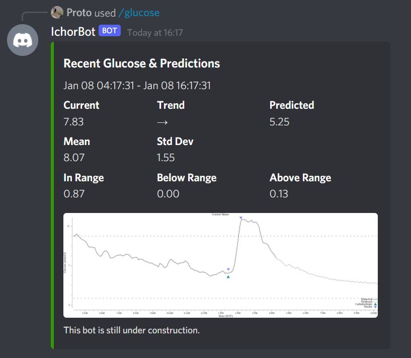

# Ichor

## About

Ichor is a Discord bot built with [arikawa](https://github.com/diamondburned/arikawa) that provides management tools for managing type 1 diabetes inspired by the likes of [Nightscout](http://www.nightscout.info/) and [LoopKit](https://loopkit.github.io/loopdocs/). It is intended to be used in tandem with the **Dexcom G6** CGM. 

This project is **highly** experimental and **not** intended to be used for therapy.

## Features 

Currently, Ichor offers a barebones set of commands.

* `/glucose` fetches the most recent glucose observations and makes glucose forecasts for the next hour. It also generates an accompanying chart.

The chart also displays any registered insulin and carbohydrate intake within the time period.

* `/weekly` generates an weekly overview of glucose values. This includes the proportion of time spent in range, below range, above range, and overall change since last week.

* `/insulin` registers the given insulin intake. Currently only supports `rapid` and `long` insulin types.
* `/carbohydrate` registers the given carbohydrate intake. Currently does not include information on the glycemic index.

## Details

A slightly more detailed overview of the project.

* A timeseries abstraction is built over [bolt](https://github.com/boltdb/bolt) to more easily store timeseries on the embedded database. For the described use cases, performance is not critical.
* A functional Dexcom client is also available that makes use of the more obscure Share API to fetch glucose + trend data in real-time.
* A neural network was trained to predict future glucose values based on **only** past glucose values. This is very experimental, and is more of a foray into Machine Learning. The training set includes roughly 4 months of CGM data from a Dexcom G6.
* Data from other CGMs like the FreeStyle Libre can also be uploaded via Apple Health using shortcuts and hooking onto the provided endpoint.

## To-Dos

Ichor is very much in an experimental phase, so changes are to be expected.

* Train a new deep neural network (maybe RNN/LSTM) using carbohydrate and insulin intake information.
* Improve the user experience via Discord using an "always-on" mode rather than the current `/glucose` and `/weekly` method.
* Setup proper model serving instead of using Docker images and tensorflow.
* Various code refactoring and optimization. Also unit tests and more logging.